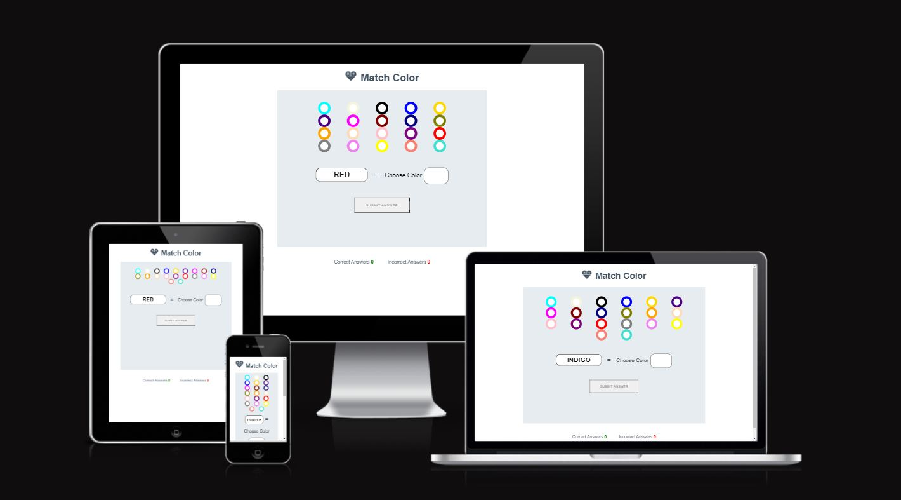
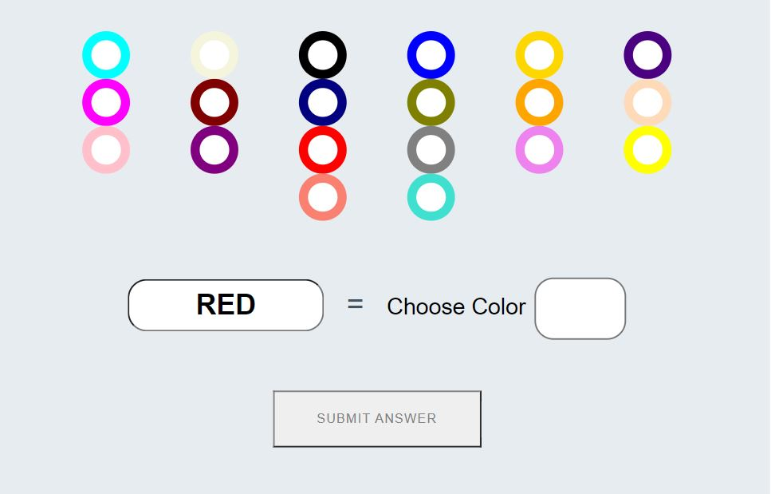
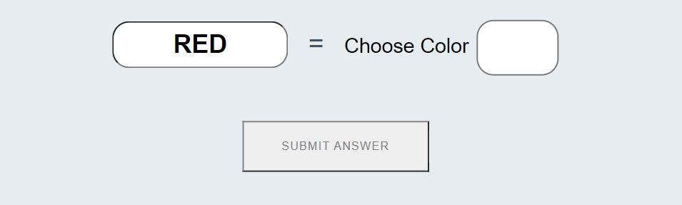
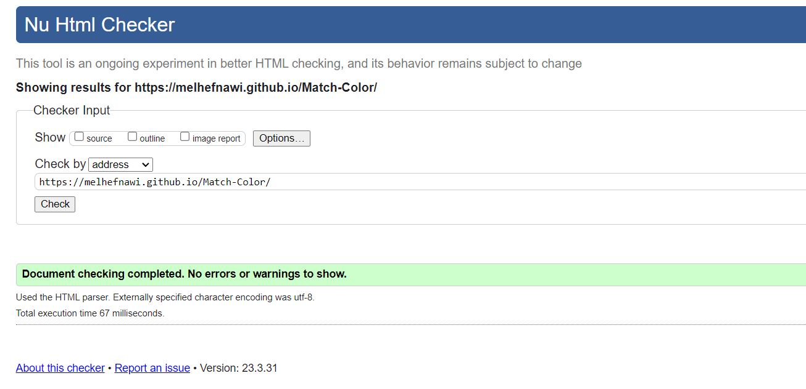
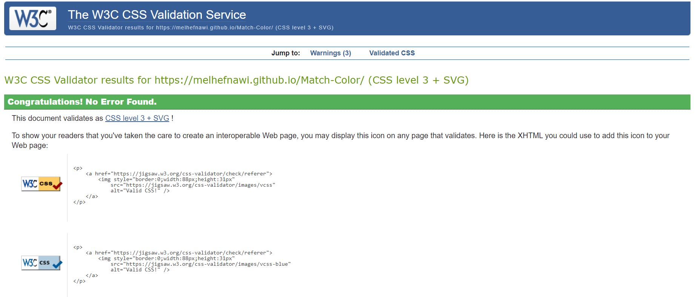
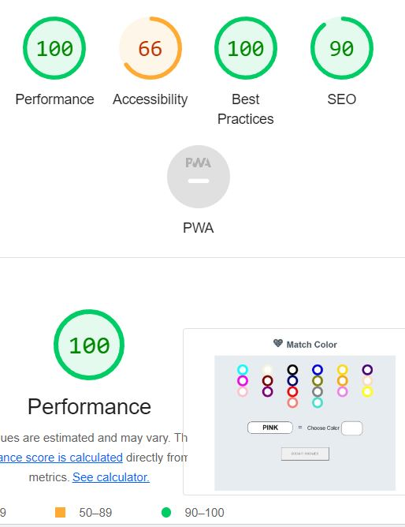

# Match Colors 

Match Colors is a site that hopes to demonstrate how pure JavaScript works in a real-world context. the site will be targeted toward people who not only love to implement more advanced JavaScript concepts but also color matching. Match Colors is a fully responsive JavaScript color game that will allow users to learn the different colors and match them with the available color option.

# Features

## Existing Features

# The Match Colors Logo and Heading
  * Featured at the top of the page, the Match Colors and heading is easy to see for the user. Upon viewing the page, the user will be able to see the name of the game.

   

# The Game Area
   * this section will allow the user to play the match colors game. the user will be able to easily see the colors icons for the different colors shown to choose one of the colors to suit the color written name. 
   * The user will be able to select one of the shown colors and by clicking the color button, it will be reflected in the text area. 
 
  

  
  # The Question section 

  * The question section is where the user will be able to see the name of the color to be matched as a part of the game. the user will be able to click the correct color from the available options.
  * The user will be able to choose one of the presented colors to match the presented name in the text area. 
  * The submitting button starts the comparison process to check if the chosen color was the one that matches the one shown in the text area.

   

  # The Score Area

  * This section will allow the user to see exactly how many correct and incorrect answers they have provided. 
 
  
  
  # Testing 

  ## Validating Testing 
  
  ## HTML
 * No errors were returned when passing through the official W3C validator 
  
   

## CSS
  
* No error were found when passing through the official (Jigsaw) validator
      
  

## JavaScript 

* No errors were found when passing through the official  Jshint validator 
* The following metrics were  returned:
* There are 13 functions in this file.
* Function with the largest signature takes 1 argument, while the median is 0
* The largest function has 12 statements in it, while the median is 2.

## Accessibility 

* I confirm that color and fonts are easy to read and accessible by running through lighthouse in devtools
        
   

    # Unfixed Bugs

    ## Deployment 

    * The site was deployed to GitHub pages. The steps to deploy are as follows:
    *  In the GitHub repository, navigate to the Setting tab
    *  From the source section drop-down menu, select the Master Branch
    *  Once the master branch has been selected, the page will be automatically refreshed with a detailed ribbon display to indicate the successful deployment. 
  
    The live link can be found here - add the link of the page <https://melhefnawi.github.io/Match-Color/>
    
    # Credits
    
    ## Content 

    * The text for the Home page was taken from the README examples in the love Math profile
    * The main body stucture in the HTML was taken from love Math project
    * The main css styling in the css was taken from love Math project.
    * Some functions in javascript is from W3 School.

  ## Media

    * The photos used on the home as logo for game is from Love Math project
    
    
   